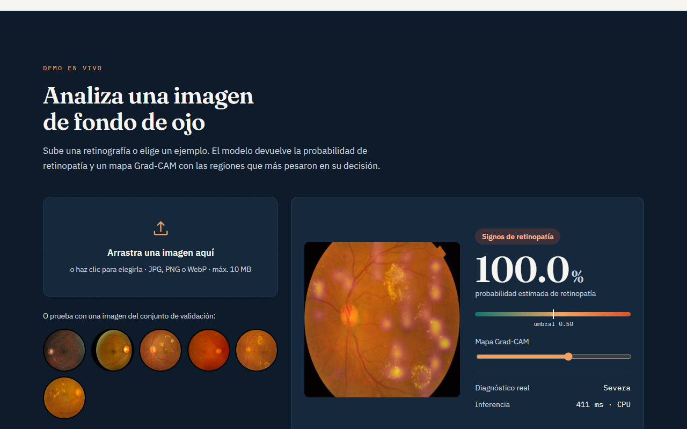
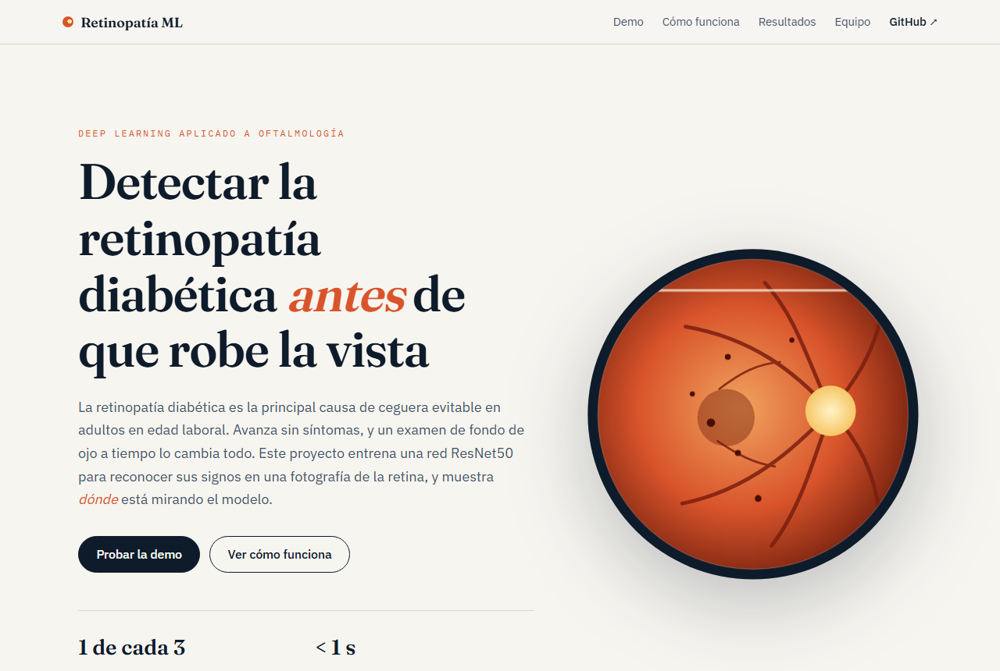

# Detección de retinopatía diabética con deep learning

[](https://github.com/gcdavidq/Maching_Learning_Group/actions/workflows/ci.yml)

Clasificador de imágenes de fondo de ojo que estima la probabilidad de **retinopatía diabética** y muestra, con un mapa **Grad-CAM**, en qué zonas de la retina se fijó para decidir. Incluye el entrenamiento (ResNet50, *transfer learning* en dos etapas), una API de inferencia sin TensorFlow (ONNX Runtime) y una web interactiva en React.

<!-- DEMO -->
> **Demo en vivo:** _pendiente de despliegue_ — ver [Despliegue](#despliegue-en-render).



## Resultados

Validación sobre 733 imágenes de APTOS 2019 que el modelo no vio al entrenar (2 929 de entrenamiento), umbral 0.5:

| AUC-ROC | Sensibilidad | Especificidad | Exactitud | F1 |
|---|---|---|---|---|
| **0.998** | **99.2 %** | 97.8 % | 98.5 % | 98.5 % |

Matriz de confusión: 353 sanos y 369 con retinopatía bien clasificados; 8 falsos positivos y **3 falsos negativos**. `EarlyStopping` se quedó con la época 8 del ajuste fino y descartó el sobreajuste de las dos siguientes. Las curvas completas están en [`models/metrics.json`](models/metrics.json) y se muestran en la web.

> Estas cifras miden el rendimiento **dentro de APTOS 2019**, no en la práctica clínica: ver [Limitaciones conocidas](#limitaciones-conocidas).



> ⚠️ Proyecto académico con fines educativos. **No es un dispositivo médico** ni sustituye la evaluación de un oftalmólogo.

## Origen

Proyecto final del curso **Introducción a Machine Learning** (Universidad Peruana Cayetano Heredia, 2024), desarrollado por:

- Edithson Ricardo Ayabar Escobar
- Magno Ricardo Luque Mamani
- Gian Carlos Quezada Marceliano

La entrega original fue un notebook de Colab ([`notebooks/01_original_upch.ipynb`](notebooks/01_original_upch.ipynb)) que competía en un Kaggle privado del curso y alcanzó un **85.9 % de exactitud en validación**. Esta versión conserva su arquitectura y su estrategia de entrenamiento, y lo convierte en una aplicación reproducible y desplegable.

### Qué cambió respecto al original

| | Original (2024) | Ahora |
|---|---|---|
| Datos | Competencia privada `upch-intro-ml` (ya no accesible) | [APTOS 2019](https://www.kaggle.com/competitions/aptos2019-blindness-detection), público, binarizado igual: 0 = sano, 1 = retinopatía |
| Color | Entrenaba en RGB y predecía en BGR (`cv2.imread`) | Un único preprocesado RGB, compartido y cubierto por tests |
| Normalización | `rescale=1/255` | La propia de ResNet50, **dentro del grafo del modelo** |
| Evaluación | *Accuracy*, con aumentación también en validación | AUC, sensibilidad, especificidad, F1 y matriz de confusión; validación sin aumentación; partición estratificada con semilla |
| Modelo | `modelo.h5`, perdido al cerrar Colab | `modelo.onnx` versionado, verificado contra Keras al exportar |
| Explicabilidad | — | Grad-CAM calculado dentro del propio ONNX |
| Uso | Celdas de notebook | API FastAPI + web React + Docker |

## Cómo funciona

```
retinografía ─► recorte del marco negro ─► 512×512 RGB ─► ResNet50 (ImageNet) ─► mapas 16×16×2048
                                                                                   │
                                     Grad-CAM (16×16) ◄── gradiente analítico ◄────┤
                                                                                   ▼
                                                  promedio global ─► Dropout 0.2 ─► Dense 256 ─► sigmoide ─► P(retinopatía)
```

- **Etapa 1:** ResNet50 congelada, se entrena solo la cabeza (Adam, lr 1e-3).
- **Etapa 2:** ajuste fino de toda la red (lr 1e-4) con `EarlyStopping` y `ReduceLROnPlateau`.
- **Grad-CAM sin TensorFlow:** entre los mapas de características y la salida solo hay un promedio y dos capas densas, así que el gradiente tiene forma cerrada, `α = W₁ᵀ(w₂ ⊙ 1[h>0])`. El mapa se calcula con operaciones normales y se exporta como segunda salida del ONNX.

## Stack

| Capa | Tecnología |
|---|---|
| Entrenamiento | Python, TensorFlow / Keras 3, scikit-learn (notebook para Kaggle o Colab, GPU T4) |
| Inferencia | ONNX Runtime (CPU), Pillow, NumPy |
| API | FastAPI + Uvicorn |
| Frontend | React 19 + Vite, CSS propio, gráficos en SVG (sin librerías de UI) |
| Calidad | pytest, Ruff, GitHub Actions |
| Despliegue | Docker → Render |

## Estructura

```
├── notebooks/
│   ├── 01_original_upch.ipynb    Entrega original del curso (registro histórico)
│   └── 02_entrenamiento.ipynb    Entrenamiento reproducible + exportación a ONNX
├── src/retinopatia/              Preprocesado, inferencia ONNX y coloreado del Grad-CAM
├── app/main.py                   API FastAPI; también sirve el frontend compilado
├── frontend/                     Web React (Vite)
├── models/                       modelo.onnx, metrics.json y ejemplos/ (salida del notebook)
├── tests/                        Tests del preprocesado y de la API (con un modelo ONNX de juguete)
├── Dockerfile
└── render.yaml                   Despliegue en Render
```

## Instalación local

Requisitos: **Python 3.10+** y **Node 20+**.

```bash
git clone https://github.com/gcdavidq/Maching_Learning_Group.git
cd Maching_Learning_Group

# Backend
python -m venv .venv
.venv\Scripts\activate            # Linux/macOS: source .venv/bin/activate
pip install -r requirements-dev.txt -e .

# Frontend
cd frontend
npm install
npm run build
cd ..

# Arrancar (API + web) en http://localhost:8000
uvicorn app.main:app --port 8000
```

Para desarrollar el frontend con recarga en caliente, deja `uvicorn` corriendo y, en otra terminal, `cd frontend && npm run dev` (http://localhost:5173; Vite reenvía `/api` al backend).

### Con Docker

```bash
docker build -t retinopatia .
docker run -p 7860:7860 retinopatia     # http://localhost:7860
```

### Tests y lint

```bash
pytest
ruff check . && ruff format --check .
```

### Variables de entorno (todas opcionales)

| Variable | Por defecto | Uso |
|---|---|---|
| `MODEL_PATH` | `models/modelo.onnx` | Ruta del modelo |
| `METRICS_PATH` | `models/metrics.json` | Métricas que muestra la web |
| `EXAMPLES_PATH` | `models/ejemplos` | Imágenes de ejemplo de la demo |
| `UMBRAL` | el de `metrics.json` (0.5) | Umbral de decisión |
| `MAX_UPLOAD_MB` | `10` | Tamaño máximo de imagen |
| `PORT` | `7860` | Puerto (solo Docker) |

No se necesitan credenciales ni servicios externos.

## API

| Método | Ruta | Descripción |
|---|---|---|
| `GET` | `/api/health` | Estado del servicio y si el modelo está cargado |
| `GET` | `/api/info` | Umbral, métricas de entrenamiento y ejemplos disponibles |
| `POST` | `/api/predict` | Campo `archivo` (JPG/PNG/WebP). Devuelve probabilidad, etiqueta, imagen normalizada y Grad-CAM (PNG con transparencia, como data URI) |

Documentación interactiva en `/docs`.

```bash
curl -F "archivo=@retina.jpg" http://localhost:8000/api/predict
```

## Reentrenar el modelo

El entrenamiento necesita GPU; en Kaggle es gratis y tarda unos 45 minutos.

1. En [Kaggle](https://www.kaggle.com/code) → *New Notebook* → *File → Import notebook* → sube `notebooks/02_entrenamiento.ipynb`.
2. *Add input* → competencia **APTOS 2019 Blindness Detection** (hay que aceptar sus reglas).
3. *Settings → Accelerator → GPU T4 x2* (o T4) y *Internet: on*.
4. *Run all*. Al terminar, descarga `artefactos.zip` desde *Output*.
5. Descomprímelo dentro de `models/` → `models/modelo.onnx`, `models/metrics.json`, `models/ejemplos/`.

Para comprobar el flujo completo sin GPU: `PRUEBA_RAPIDA=1` entrena una época con 48 imágenes.

## Despliegue en Render

El plan gratuito de [Render](https://render.com) (512 MB de RAM) es suficiente: el contenedor usa ~350 MB en carga.

1. Sube el repositorio a GitHub y crea una cuenta en Render con tu usuario de GitHub.
2. **New → Blueprint** → elige este repositorio. Render lee [`render.yaml`](render.yaml), construye el `Dockerfile` y publica el servicio.
3. En unos 5-10 minutos queda en `https://retinopatia-ml.onrender.com` (o el nombre que Render asigne). Cada `git push` a `main` redespliega.

A tener en cuenta en el plan gratuito: el servicio **se duerme tras 15 minutos sin visitas** y la primera carga tarda ~1 minuto en despertar; con 0.1 CPU cada predicción tarda varios segundos.

Al ser un contenedor estándar, el mismo `Dockerfile` sirve en Railway, Fly.io, Koyeb o Cloud Run.

## Limitaciones conocidas

- **Métricas optimistas por construcción:** en APTOS 2019 distinguir «sano» de «con retinopatía» es relativamente fácil, en parte porque las imágenes de cada clase difieren también en cámara y encuadre, no solo en lesiones. El modelo puede estar apoyándose parcialmente en esas pistas.
- **Dominio de los datos:** entrenado solo con APTOS 2019 (un hospital de la India, un tipo de cámara). Con retinografías de otros equipos o poblaciones el rendimiento puede caer.
- **Sin identificadores de paciente:** APTOS no los publica, así que no se puede garantizar que los dos ojos de una persona queden en el mismo lado de la partición; las métricas podrían ser ligeramente optimistas.
- **Binario:** detecta presencia de retinopatía, no su grado.
- **Grad-CAM** tiene resolución 16 × 16: señala regiones, no lesiones individuales.
- Las imágenes de `models/ejemplos/` provienen de APTOS 2019 y se incluyen solo con fines demostrativos y académicos, conforme a las reglas de la competencia.
